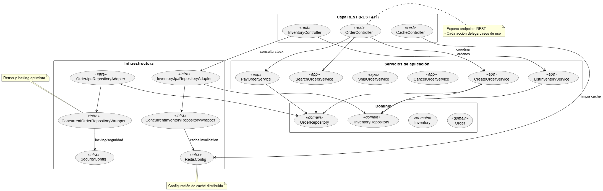

# Visión general de la arquitectura

## Contexto

La aplicación de ecommerce está organizada en capas: controladores REST, servicios de aplicación, lógica de dominio y adaptadores de infraestructura. El siguiente diagrama resume los componentes principales y sus interacciones.

```
+-------------------+         +-------------------------+
|     REST API      |<------->|     Servicios de        |
| (Controllers)     |         |     Aplicación          |
+---------+---------+         +-----------+-------------+
          |                               |
          v                               v
+---------+---------+         +-----------+-------------+
|  Infraestructura  |<------->|      Dominio            |
| (Adapters, Config)|         | (Entidades, Puertos)    |
+---------+---------+         +-----------+-------------+
          |                               |
          v                               v
+---------+---------+         +-----------+-------------+
| Persistencia (JPA)|         |  Eventos / Mensajería   |
| Redis Cache       |         |  (Spring Events)        |
+-------------------+         +-------------------------+
```

## Diagrama de componentes (PlantUML)




## Flujo de datos

1. **Request**: llega a los controladores REST (documentados con Swagger).
2. **Caso de uso**: los servicios de aplicación coordinan la lógica de negocio.
3. **Dominio**: las entidades aplican invariantes y exponen puertos para persistencia.
4. **Infraestructura**: los adaptadores implementan los puertos usando JPA y gestionan el locking optimista.
5. **Persistencia/Caché**: PostgreSQL almacena el estado; Redis sirve para lecturas recurrentes.
6. **Eventos**: los eventos de dominio notifican cambios de estado a otros componentes.

## Notas de despliegue

- El servicio es stateless; la sesión viaja en el JWT.
- `docker-compose.yml` Redis para desarrollo local.

